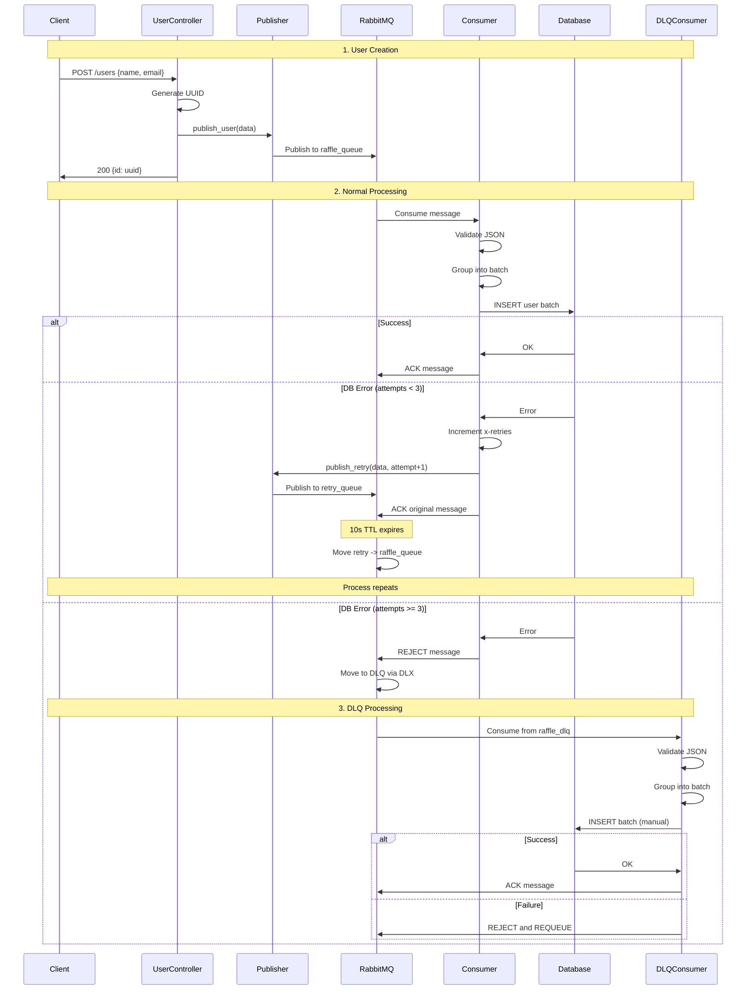
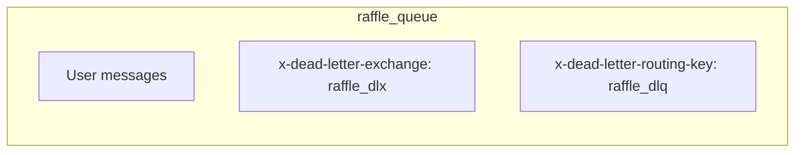
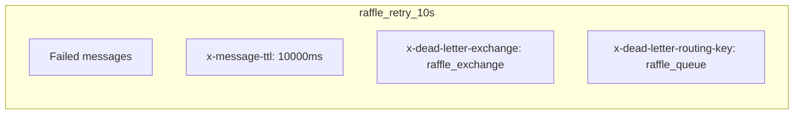
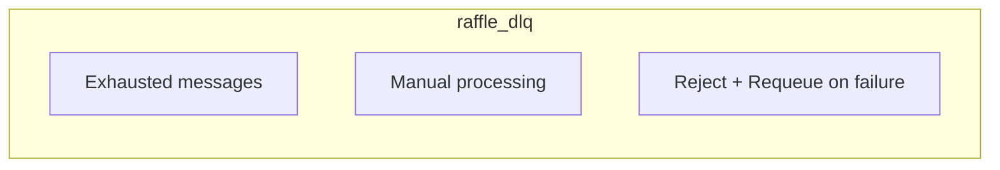
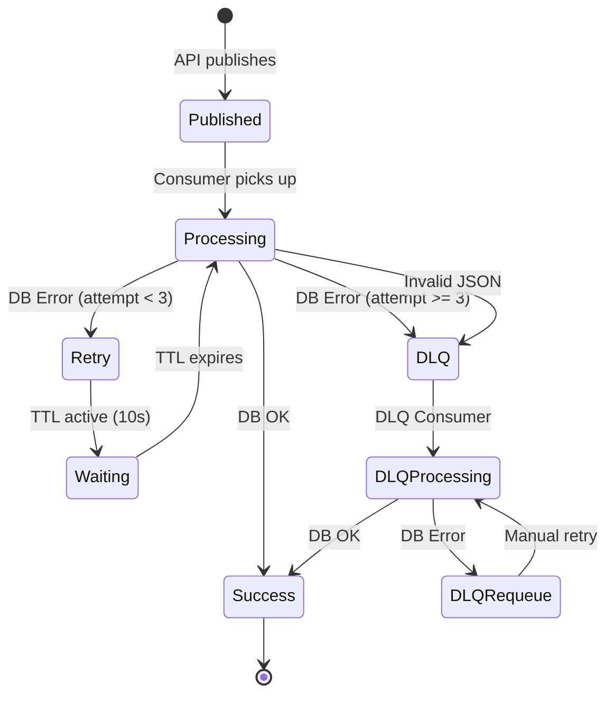

# User Queuing Process - RaffleAPI

## Overview

This document describes the user enrollment queuing process in RaffleAPI, including the RabbitMQ queue system, automatic retry, and Dead Letter Queue (DLQ).

## System Architecture


## Detailed Process Flow



## Queue Configuration

### Main Queue (raffle_queue)


### Retry Queue (raffle_retry_10s)


### Dead Letter Queue (raffle_dlq)


## Message States



## Control Headers

### Original Message
```json
{
  "id": "uuid-v4",
  "name": "John Silva",
  "email": "john@email.com"
}
```

### Message with Retry
```json
Headers: {
  "x-retries": 1,
  "x-retry-reason": "db_error: connection timeout"
}
Body: {
  "id": "uuid-v4",
  "name": "John Silva",
  "email": "john@email.com"
}
```

## Environment Configuration

| Variable | Default | Description |
|----------|---------|-------------|
| `RETRY_TTL_MS` | 10000 | Retry queue TTL in ms |
| `MAX_RETRIES` | 3 | Maximum attempts before DLQ |
| `USERS_BATCH_SIZE` | 1000 | Batch size for insertion |
| `USERS_BATCH_TIMEOUT_MS` | 1000 | Batch timeout in ms |
| `USERS_PROC_CONCURRENCY` | 8 | Processor concurrency |
| `USERS_BATCH_CONCURRENCY` | 2 | Batcher concurrency |

## Monitoring and Observability

### Important Logs

1. **Publisher**: Connection and publication failures
2. **Consumer**: Processing errors and retries
3. **DLQConsumer**: Manual processing of failed messages

### Suggested Metrics

- Main consumer success rate
- Number of messages in retry queue
- Number of messages in DLQ
- Processing latency
- Error rate by type

## Failure Scenarios

### 1. Temporary Database Failure
- **Action**: Automatic retry with backoff (TTL)
- **Limit**: 3 attempts
- **Recovery**: Automatic when DB comes back

### 2. Persistent Database Failure
- **Action**: Message goes to DLQ
- **Recovery**: Manual processing via DLQConsumer

### 3. Malformed JSON
- **Action**: Direct reject to DLQ
- **Recovery**: Error log, message discarded

### 4. RabbitMQ Failure
- **Action**: Publisher returns error to API
- **Recovery**: Client can retry

## Performance Considerations

- **Batching**: Reduces DB transaction overhead
- **Concurrency**: Configurable per environment
- **Persistence**: Messages survive restarts
- **Durability**: Queues and exchanges are durable

## Generating Diagram Images

To generate images from Mermaid diagrams, you can use:

1. **Mermaid CLI**:
```bash
# Install mermaid-cli
npm install -g @mermaid-js/mermaid-cli

# Generate images (run from project root)
mmdc -i docs/user_queue_process.md -o docs/images/ -t dark
```

2. **Online**: Copy diagrams to [Mermaid Live Editor](https://mermaid.live/) and export images.

3. **VS Code**: Use "Mermaid Preview" extension to visualize and export.
