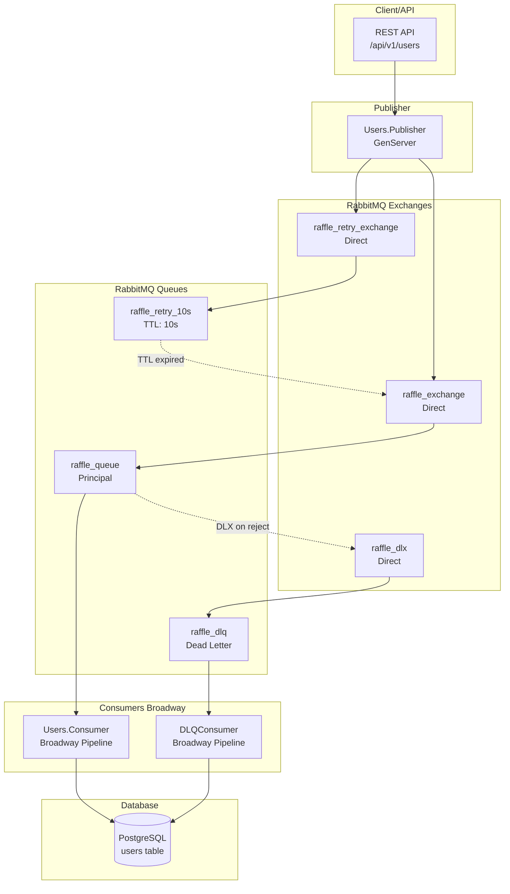
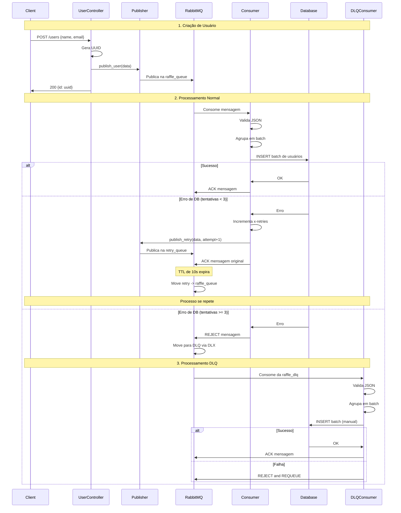
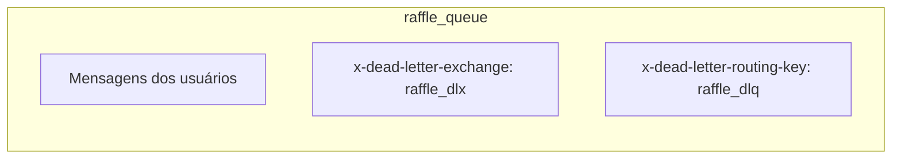
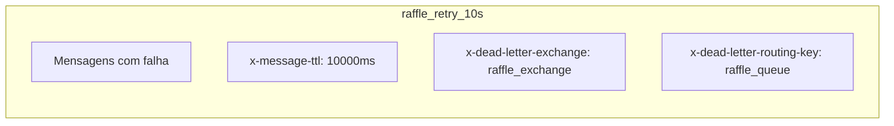
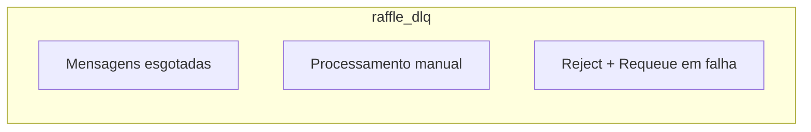
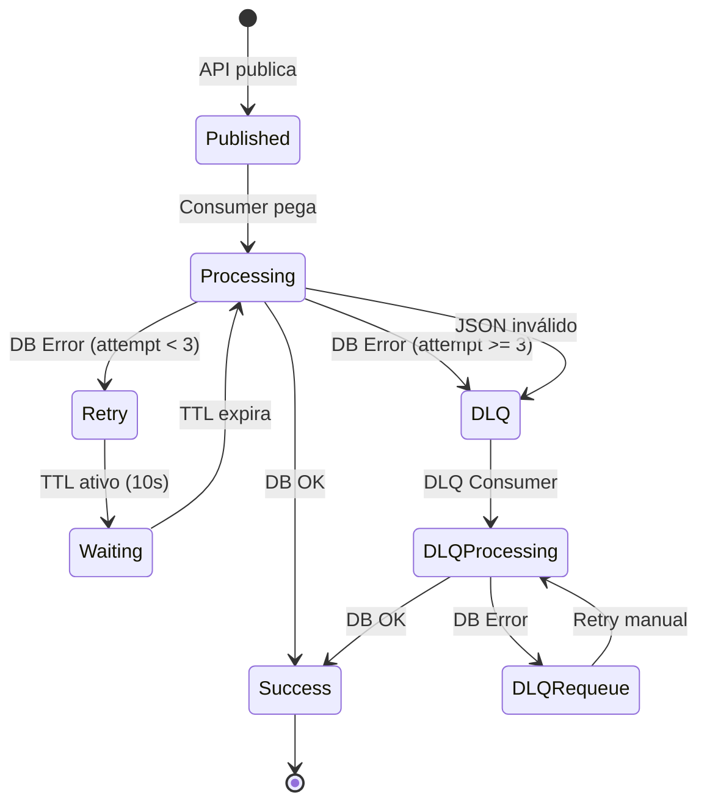

# Processo de Enfileiramento de Usuários - RaffleAPI

## Visão Geral

Este documento descreve o processo de enfileiramento de novos usuários na RaffleAPI, incluindo o sistema de filas RabbitMQ, retry automático e Dead Letter Queue (DLQ).

## Arquitetura do Sistema



## Fluxo Detalhado do Processo



## Configuração das Filas

### Fila Principal (raffle_queue)


### Fila de Retry (raffle_retry_10s)


### Dead Letter Queue (raffle_dlq)


## Estados das Mensagens



## Headers de Controle

### Mensagem Original
```json
{
  "id": "uuid-v4",
  "name": "João Silva",
  "email": "joao@email.com"
}
```

### Mensagem com Retry
```json
Headers: {
  "x-retries": 1,
  "x-retry-reason": "db_error: connection timeout"
}
Body: {
  "id": "uuid-v4",
  "name": "João Silva",
  "email": "joao@email.com"
}
```

## Configurações de Environment

| Variável | Padrão | Descrição |
|----------|---------|-----------|
| `RETRY_TTL_MS` | 10000 | TTL da fila de retry em ms |
| `MAX_RETRIES` | 3 | Máximo de tentativas antes do DLQ |
| `USERS_BATCH_SIZE` | 1000 | Tamanho do batch para inserção |
| `USERS_BATCH_TIMEOUT_MS` | 1000 | Timeout do batch em ms |
| `USERS_PROC_CONCURRENCY` | 8 | Concorrência dos processors |
| `USERS_BATCH_CONCURRENCY` | 2 | Concorrência dos batchers |

## Monitoramento e Observabilidade

### Logs Importantes

1. **Publisher**: Falhas de conexão e publicação
2. **Consumer**: Erros de processamento e retry
3. **DLQConsumer**: Processamento manual de mensagens falhas

### Métricas Sugeridas

- Taxa de sucesso do consumer principal
- Número de mensagens na fila de retry
- Número de mensagens no DLQ
- Latência de processamento
- Taxa de erro por tipo

## Cenários de Falha

### 1. Falha Temporária de Banco
- **Ação**: Retry automático com backoff (TTL)
- **Limite**: 3 tentativas
- **Recovery**: Automático quando DB volta

### 2. Falha Persistente de Banco
- **Ação**: Mensagem vai para DLQ
- **Recovery**: Processamento manual via DLQConsumer

### 3. JSON Malformado
- **Ação**: Reject direto para DLQ
- **Recovery**: Log de erro, mensagem descartada

### 4. Falha do RabbitMQ
- **Ação**: Publisher retorna erro para API
- **Recovery**: Cliente pode tentar novamente

## Considerações de Performance

- **Batching**: Reduz overhead de transações DB
- **Concorrência**: Configurável por ambiente
- **Persistência**: Mensagens sobrevivem a restarts
- **Durabilidade**: Filas e exchanges são duráveis

## Gerando Imagens dos Diagramas

Para gerar as imagens dos diagramas Mermaid, você pode usar:

1. **Mermaid CLI**:
```bash
# Instalar mermaid-cli
npm install -g @mermaid-js/mermaid-cli

# Gerar imagens (executar na raiz do projeto)
mmdc -i docs/user_queue_process.md -o docs/images/ -t dark
```

2. **Online**: Copie os diagramas para [Mermaid Live Editor](https://mermaid.live/) e exporte as imagens.

3. **VS Code**: Use a extensão "Mermaid Preview" para visualizar e exportar.
